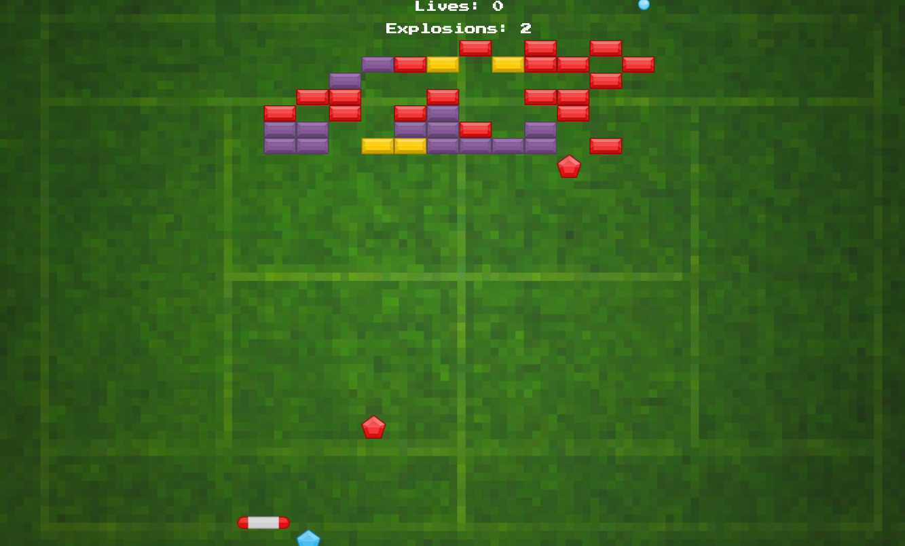

# Strategy Pattern - Breakout



## Installatie

1. Installeer TypeScript
```
npm install -g typescript
```
Mocht het commando tsc niet herkent worden. Sluit Visual Studio Code en start het opnieuw op.

Met CRTL + SHIFT + B kan je de watch starten en de code compileren.

## Spelregels

Breakout is een spel waar je met een balkje een bal kan terugkaatsen. Iedere keer dat de bal een (paars) blok raakt, verdwijnt het blok. In de scorebalk gaat er van het totaal aan blokjes 1 blok af. 

Ook zijn er blokken met een gele kleur. Deze verdwijnen niet direct als de bal het blok raakt. Wanneer deze door de bal geraakt wordt, verandert de kleur naar paars. Als de bal het blok nog een keer raakt, verdwijnt het blok en laat deze een powerup los.

Als de speler deze powerup oppakt, wordt deze actief. Er zijn twee verschillende:
- Blauw: het balkje kan 2x zo snel bewegen
- Rood: het balkje kan niet meer bewegen
- Geel: Bedenk hier zelf een effect voor

De bal kan ook tegen de onderkant van het scherm stuiteren zodat je als spel nooit af kan gaan. 

*[Optioneel]*
Als de bal aan de onderkant het scherm verlaat, worden het balkje en de bal gereset naar hun beginpositie. Ook in de scorebalk gaat er 1 leven vanaf. 

Als er geen levens meer over zijn is het game over. Dit wordt getoond in de scorebalk. 

### Balkje
- kan links en rechts bewegen met de pijltjestoetsen
- kan het scherm niet uit
- start in het midden van het scherm en een klein stukje (5%) vanaf de onderkant. 
- heeft een snelheid van 7

### Ball
- start net boven het midden van het balkje. 
- heeft een snelheid -7 op de y-as
- heeft op de x-as willekeurig een snelheid van -3 of 3

### Upgrade
- is een bepaalde tijd actief (1 seconde, mag je zelf bepalen)

### Blok
- als een bal met een blok botst is het voldoende om de y om te keren. Er hoeft geen rekening gehouden te worden met een botsing tegen de zijkant. 
- in het veld wordt in 30% van de gevallen een geel blok geplaatst ```if(Math.random() < 0.3)```

## Tips
Om het grid met blokken op te bouwen kun je de volgende code gebruiken. Het is aan jou waar je deze code gebruikt
```
    let rows        : number = 7
    let columns     : number = 12
    let brickWidth  : number = 64
    let brickHeight : number = 32

    for (let row = 0; row < rows; row++) {

        for (let column = 0; column < columns; column++) {

            // plaats het grid met blokken in het midden van het scherm
            let offsetX = (window.innerWidth - columns * brickWidth) / 2
            let x = column * brickWidth + offsetX
            
            // en op de y-as 100px vanaf de top
            let y = row * brickHeight + 100
            
            // Voeg op deze plek een nieuw blok toe aan het spel
            console.log(`Place brick at (${x}, ${y})`)
        }
    }
```